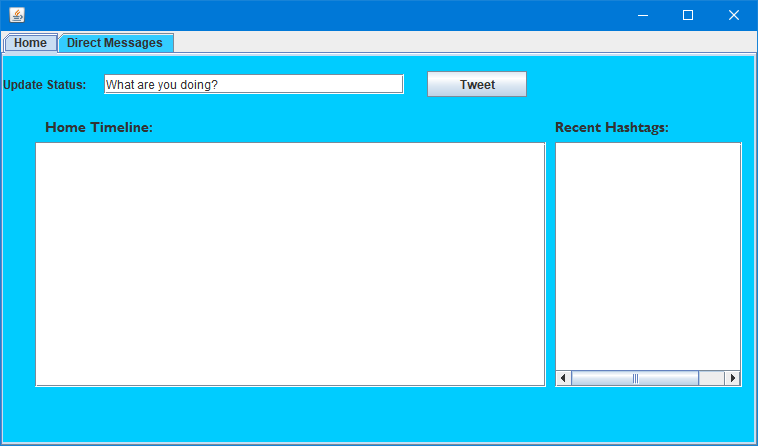
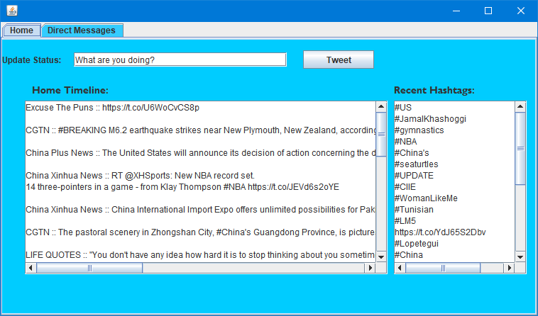
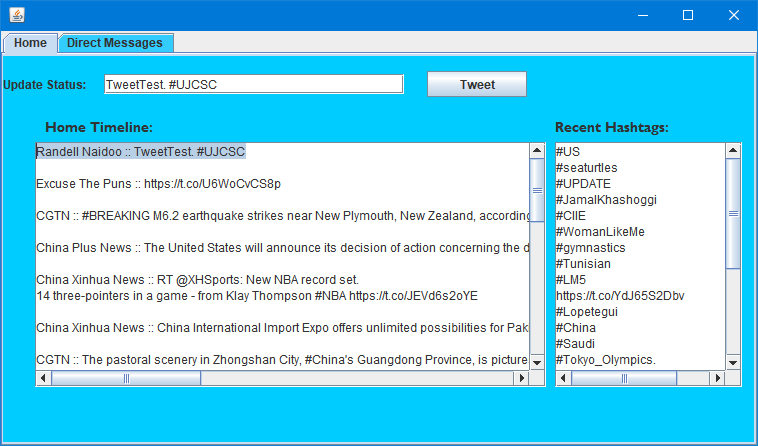
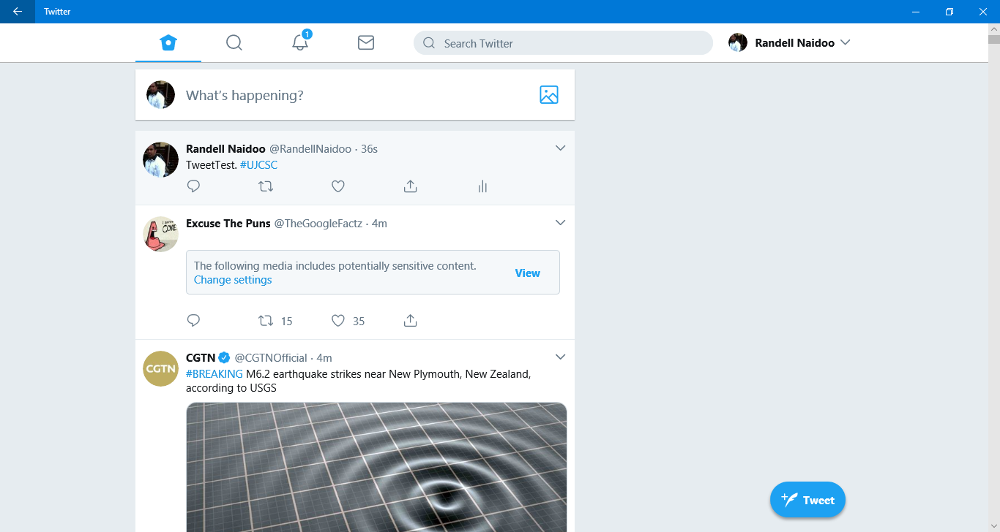

# TwitterApp
Java application that makes use of the Twitter API, that allows you to update your status and DM friends, as well as see the latest trends.

# Libraries Required

Donwload Twitter4J 4.0.7 (Latest Stable Version) Library from http://twitter4j.org/en/

1.Unzip Folder
2.Right Click on project in Eclipse
3.Click Properties
4.Go to Build Path
5.Select Add External JARs
6.Search through to Twitter4J 4.0.7 folder
7.Go to the "lib" folder
8.Add the "twitter4j-core-4.0.7.jar" file

All libraries should be imported now.

# Direction of use

Once you run the program, give it about 10 seconds to auto sign in.
Twitter feed can only be run 15 times in a minute, as per limit usage by Twitter.
It will display the most recent tweets on the timeline, and display all most recent hashtags used.
It will allow you to post a tweet to the timeline.
Test Hashtag function by posting a test tweet with a hashtag. 

You are able to send DM's to only those that follow you. DO NOT INCLUDE "@" WHEN SENDING DM  

If any failures occur, Twitter API will alert of the error with brief descritpion.

# Screenshots

- 

-

![alt text](screenshots/3.png "Twitter Feed 2"

- 

- 

